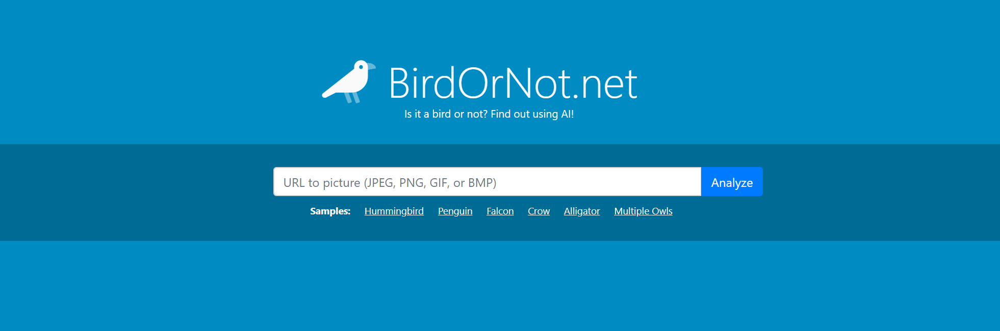
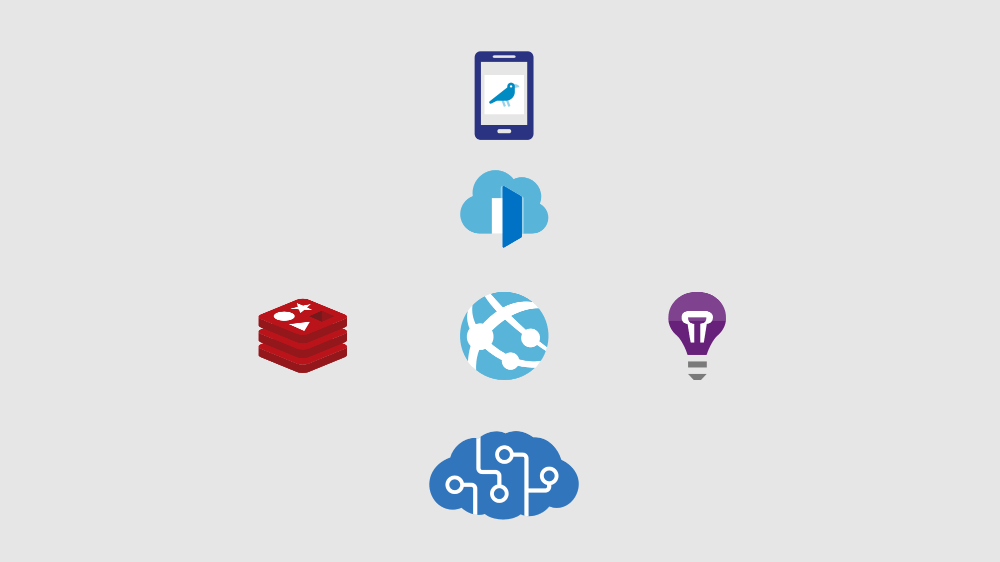

# BirdOrNot.net - Is it a bird or not?

As a technical person and developer, I'm a big fan of [XKCD](https://xkcd.com/) which makes entertaining comics about our industry. A couple of years ago I stumbled upon this one:


Turns out that it was published September 2014, almost exactly 5 years ago, the time the team would need to solve the problem according to the comic. So, I thought, this should be solved now, right? And it turns out it did!

## Today I'm proud to announce: BirdOrNot.net



BirdOrNot.net uses the object detection capability in [Azure Cognitive Services](https://bit.ly/azure-cog-computer-vision) to find out if the image contains a bird and, in some cases, it even finds out what species it is. I didn't have to hire a team of researchers for five years, instead Microsoft did and made the result available as a service in Azure.

Using that specific service, I was able to go from idea to working concept in under an hour, with a few more hours spent on CSS :)

Below you can see a few samples, feel free to try it out yourself on the site:
[https://birdornot.net/](https://birdornot.net/)


It builds on the default object detection model provided by Azure Cognitive Services, which can detect anything from buildings, vehicles to animals. It does a very good job of detecting birds, but as it's not specialized on birds, there will be cases where it makes mistakes. Still, shows how the power of AI and ML can be used by everyone who knows how to call a webservice.

If you boil it down, these are the few lines that powers the site:
```csharp
var imageAnalysis = await computerVisionClient.AnalyzeImageAsync(url, new List<VisualFeatureTypes>
{
    VisualFeatureTypes.Objects
});

var isBird = imageAnalysis.Objects.Any(x => x.ObjectProperty.Equals("bird"));

Console.WriteLine(isBird ? "It is a bird." : "It is not a bird.");
```

You can see a simple [sample with the code above at GitHub](https://github.com/PeterOrneholm/BirdOrNot.net/tree/master/src/Orneholm.BirdOrNot.SimpleSample/Program.cs).

## Behind the scenes

The source code is [fully available at GitHub](https://github.com/PeterOrneholm/BirdOrNot.net/tree/master/src/Orneholm.BirdOrNot.SimpleSample), feel free to dig around to learn how it works. If you want to run it yourself, the image that runs on the site is available at dockerhub ([peterorneholm/orneholmbirdornotweb](https://hub.docker.com/r/peterorneholm/orneholmbirdornotweb)).

```bash
docker run --env AzureComputerVisionSubscriptionKey=XYZ --env AzureComputerVisionEndpoint=ABC peterorneholm/orneholmbirdornotweb
```

For those of you that are interested, here comes a brief explanation on the setup.

### Architecture



### Object recognition

The service is using [Azure Cognitive Services](https://bit.ly/azure-cog-computer-vision) to analyse the image. It fetches the following info:

- `VisualFeatureTypes.Objects` (Used for detecting the birds and getting their bounding rectangles. Checks the object hierarchy to detect species.)
- `VisualFeatureTypes.Description` (Used to describe the image with text and tags.)
- `VisualFeatureTypes.Adult` (Used to decline images classed as Adult, Gory or Racy.)

### Code

The website is written in [ASP.NET Core 3](https://asp.net/) and packaged as a container running Linux.

### Hosting

The container is published to dockerhub and then automatically deployed to [Azure App Service](https://azure.microsoft.com/en-us/services/app-service/containers/) for easy management and scale out if needed.

### Cache

The costly part in the application (both money and time) is the analysis of an image, therefore every unique URL is cached. The application uses the [IDistributedCache](https://docs.microsoft.com/en-us/aspnet/core/performance/caching/distributed?view=aspnetcore-3.0) interface and is configured to use [Azure cache for Redis (hosted)](https://azure.microsoft.com/en-us/services/cache/) as the implementation.

In case the site would go viral, I'm distributing it through [Azure Frontdoor](https://azure.microsoft.com/en-us/services/frontdoor/). By doing so I have HTTP cache at the edge so that the samples and landing page will have no impact on the backend and be served immediately.

### Analytics

The site is monitored through [Azure Application Insights / Azure Monitor](https://azure.microsoft.com/en-us/services/monitor/). I store anonymous telemetry on how the site is used and by collecting feedback on wheter or not the audience agrees with the AI motor, it could be used to improve over time.

I've activated a custom alert that will send me an email in case the traffic to the site would rapidly increase.

### Cost

There are a few basic costs involved. But the part that could become expensive is the analytics of images. I've estimated it to cost roughly *$5 USD / 1000 images* analyzed. By caching the results I'm preventing the samples to cost me any money and I will be able to handle the cost for quite a lot of images.

## Interested in even more details?

If you or your company wants to know more about services like this, I deliver a session/Workshop called "[Democratizing AI with Azure Cognitive Services](http://bit.ly/peterorneholm-democratizing-ai)" which shows the potential of Cognitive Services by fun and creative examples. Please drop me an email if you want more details.